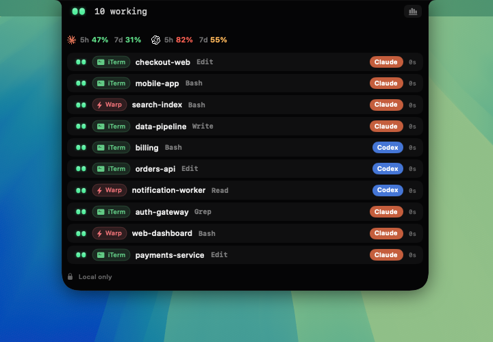

# NotchFlow

[](https://github.com/cloudstudio/NotchFlow/actions/workflows/ci.yml)
[](LICENSE)


**Your coding agents, at a glance — from the notch.**



NotchFlow is a tiny native macOS app that lives in your MacBook's notch and shows
what your AI coding agents (**Claude Code**, **Codex**) are doing in real time:
who's working, who needs your permission, who's done. Glance up, approve from the
notch, keep coding. Local‑only, no account, no telemetry.


https://github.com/user-attachments/assets/3c811d93-4a16-49cc-a1ff-99c54597c6ed


---

## Install (plug and play)

Requires **macOS 14+** and the Swift toolchain (Xcode or the Command Line Tools:
`xcode-select --install`).

```bash
git clone https://github.com/cloudstudio/NotchFlow.git
cd NotchFlow
./install.sh
```

That's it. `install.sh` builds the app, installs it to `~/Applications`, wires the
Claude Code / Codex hooks, and launches it. Start a coding agent and the notch
lights up.

## What it does

- **Live status** — a calm dot‑matrix face and per‑session state: working, running a
  tool, **needs your permission**, idle, done, failed.
- **Approve from the notch** — when an agent asks permission, Allow / Deny right
  there without switching windows.
- **Voice alerts** — it literally talks: when a session finishes or gets stuck,
  NotchFlow tells you out loud, so you can stop babysitting terminals.
- **Quota & cost** — your Claude / Codex plan windows and today's API‑equivalent spend.
- **Sub‑agents** — a Task fan‑out shows as a nested swarm.
- **Monitoring plugins** — click‑to‑focus desktop alerts, an idle/stuck watchdog, and
  optional auto‑approve for read‑only tools. All local, all toggleable.

## How it works

NotchFlow installs lightweight **hooks** into Claude Code / Codex that emit
lifecycle events over a local Unix socket to the app. It only *observes* your
agents — it never runs them, never phones home, and stores nothing off your Mac.

## Uninstall

```bash
rm -rf ~/Applications/NotchFlow.app
```
(and remove the NotchFlow hook entries from `~/.claude/settings.json` if you like).

## Build manually

```bash
./Packaging/build-app.sh --install   # build + install the .app
swift build                          # just compile
swift test                           # run the core tests
```

## Contributing

Issues and PRs welcome. The code is small and focused:

- `Sources/NotchFlowCore` — the model: agent events, the session reducer, the hook protocol.
- `Sources/NotchKit` — the notch UI, the observer (`AppModel`), quota/usage monitors, plugins.
- `Sources/NotchApp` — the thin app that puts the notch on screen.
- `Sources/NotchFlowHook` / `NotchFlowInstaller` — the agent hook + its installer.

See **[CONTRIBUTING.md](CONTRIBUTING.md)** for build/test/toolchain notes and
**[SECURITY.md](SECURITY.md)** for the trust boundary and how to report issues.

## License

[MIT](LICENSE).
